This repository is not maintained anymore, archived and only available for referential purposes. Please do not use this code as is and be aware that it might contain issues, which are not looked after anymore. 

### How to Add a New Portlet to Liferay

On the wiki page [Deploy Liferay](https://github.com/sw360/sw360portal/wiki/Deploy-Liferay), it is described how to deploy the lar-files to Liferay. Nevertheless, the administrator 
might want to deploy more portlets later on and therefore it is necessary to add the portlets to the UI.

To that end, log in as an admin and choose in the `Admin` menu of Liferay the option `Pages`:

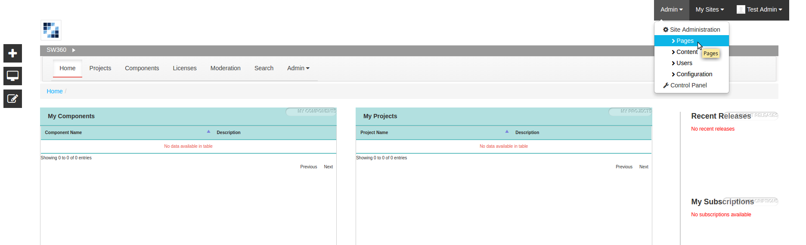

Select the tab `Private Pages` and choose an existing Portlet (e.g. the `Projects` portlet in the example) to which you want to add a child page. If you want to add a page to the main menu, select the root `Private Pages`:

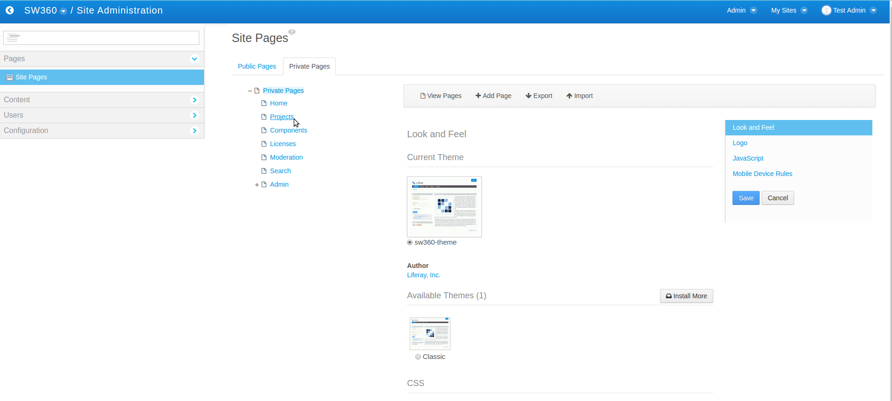

Click `Add Child Page`:

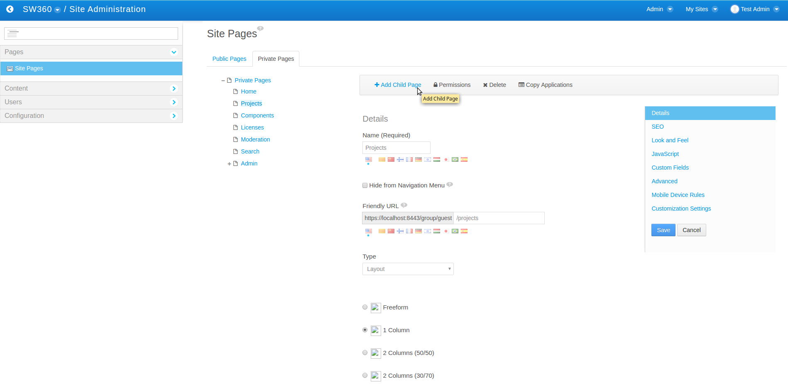

Type the name of the child page and select the desired layout (e.g. `1 Column` if only one portlet has to be added to the child page):

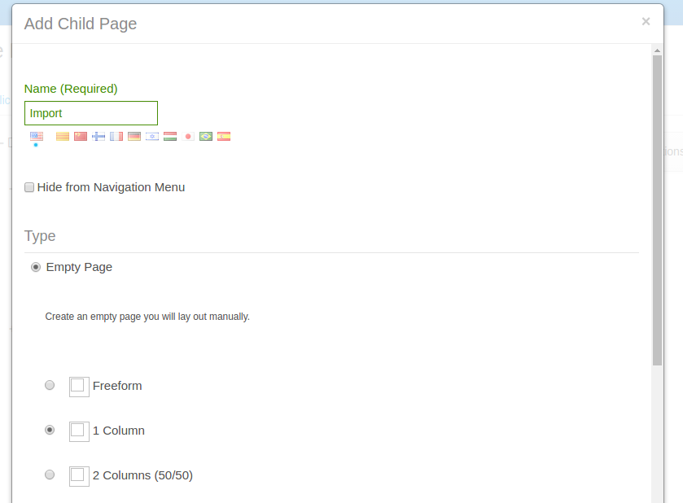

Now, you have to switch temporarily to the `classic theme`, since the `SW360-theme` causes problems when adding portlets:
 
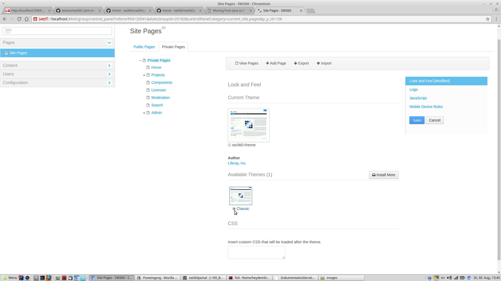

Then, chose the `Private Pages` from the Liferay menu `My Sites`:

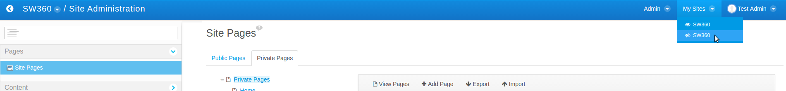

Go to the new (child) page and click `Add` on the left hand side:

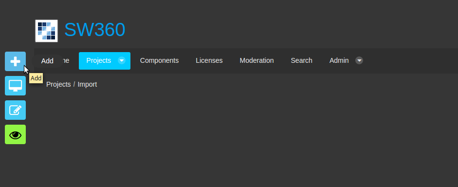

Choose `Applications` and select `SW360` from the menu:

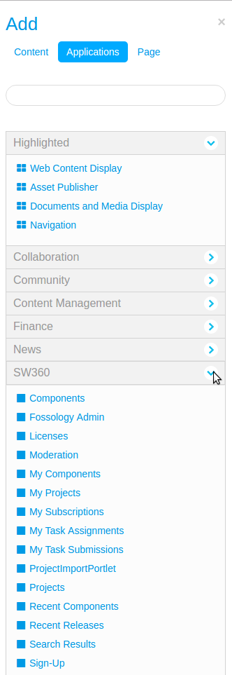

If `SW360` is not available, make sure you have installed and deployed the portlets properly.
 
 With _drag and drop_, move the appropriate portlet to the right place on the page:
 
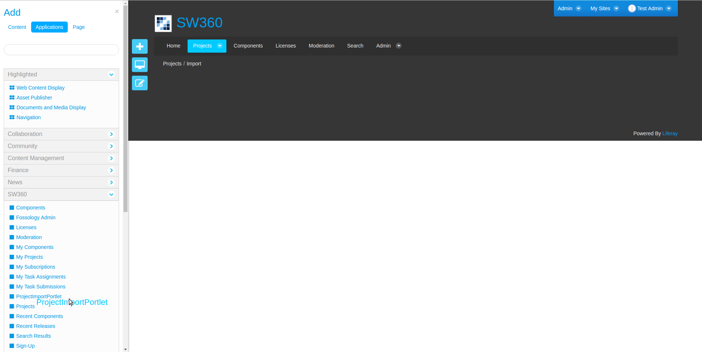

Now, we have to remove the border. Therefore, click on `Options` in the upper right corner and select `Look and Feel`:

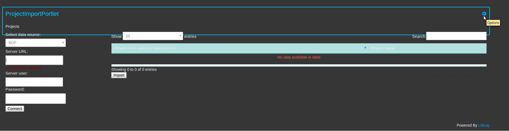

Set `Show Borders` to `No` and click `Save`. Set the theme back to the `SW360-theme` as described above.
The result in our example should look as follows:

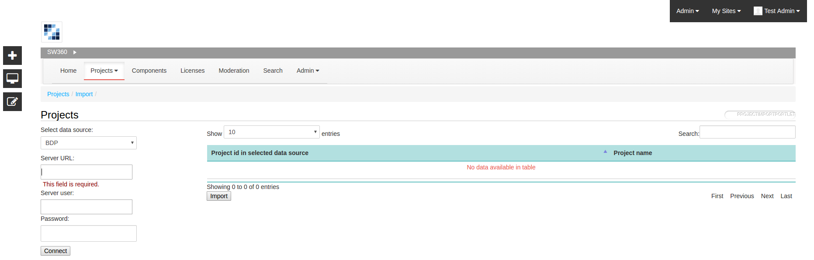
